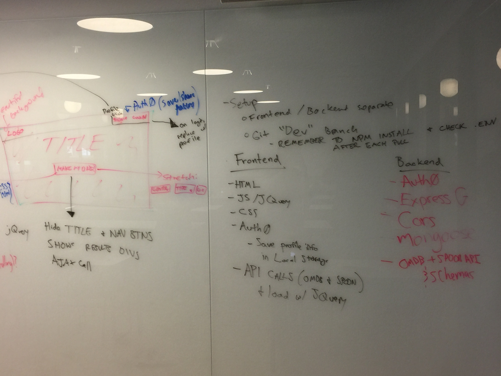

##Date Night README.md

##The Minimally Viable Product (MVP)
A tool to help pick out a film and recipe for a fun twist on the most classic of date nights, dinner and a movie.

##Splash page
    1. Header across all pages with:
        * Logo
        * Login with auth0
       2. Dropdown categories for movies and recipes
       3. footer with api information

##Results Page
       1. header
       2. Display both api results with:
           * title
           * picture
           * summary (+ recipe url)
       3. save button

##Profile Page
       1. header
       2. display each “date” as an li with:
          * username and photo
       3. pictures of movie and recipe

##User Stories
       1. For the person who sucks at planning dates
       2. For the person who doesn’t have a date
    3. For the couple who needs to spice things up
    4. For a fun night with friends

##Stretch
       * add genre categories to results page    
       * add get next buttons to results page    
       * scrape recipe api        
       * profile page:                    
           1. add tabs for public/my dates so user can look at all vs none
           2. add timestamp to dates
           3. save recipe links to saved dates
           4. add crud to dates so users can add their own title, quick note
           5. add EDIT option for users
           6.  add DELETE option so users can remove saved dates
           7. prevent users from editing/deleting other people’s dates

